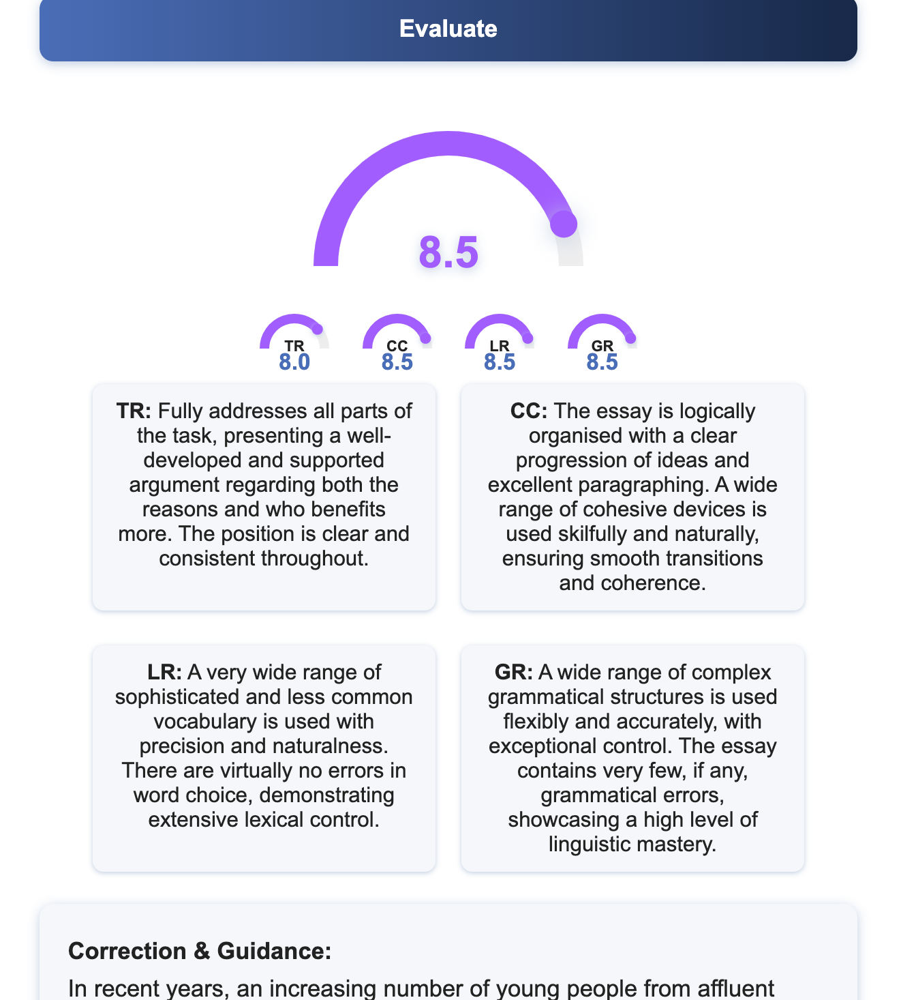
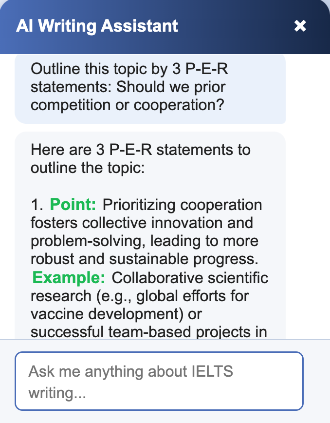

# IELTS Enhancer

**Unlock your full potential in IELTS Writing!**

IELTS Enhancer is your personal, AI-powered writing coach designed to help you reach your dream band score. Whether you're aiming for a 6.0 or striving for a perfect 9.0, this app gives you the tools, feedback, and motivation to get there.

---

**APP** [Live Demo](https://ielts-writing-boost.vercel.app)

## Why You'll Love IELTS Enhancer

- **Instant, Honest Grading:** Get your writing evaluated in seconds, with a clear band score and color-coded speedometer that makes your progress feel real and exciting.
- **Creative, Academic Guidance:** Receive not just a grade, but detailed, actionable feedback. See exactly what to fix, with mistakes and improvements highlighted visually—so you learn faster, and smarter.
- **Model Answers & Corrections:** Compare your work to high-band model answers, and see your own writing transformed with AI-powered corrections and suggestions.
- **Supports Both Writing Parts:** Whether it's a tricky graph (Part 1) or a complex essay (Part 2), IELTS Enhancer is ready for any challenge—including image-based questions!
- **Beautiful, Motivating Design:** Enjoy a modern, creative interface that makes practice feel less like a chore and more like a journey.

## How It Works
1. **Choose your target band and writing part.**
2. **Paste your question and answer** (or upload an image for Part 1).
3. **Get instant feedback, corrections, and a model answer**—all powered by cutting-edge AI.

---
**Interactive UI**

  <table>
    <tr>
      <th colspan="2" style="text-align:center;"><strong>Question & Answer</strong></th>
      <th colspan="2" style="text-align:center;"><strong>Grading & Correction</strong></th>
      <th colspan="2" style="text-align:center;"><strong>Feedback & Polish</strong></th>
    </tr>
    <tr>
      <td></td>
      <td></td>
      <td></td>
      <td></td>
      <td></td>
      <td></td>
    </tr>
    <tr>
      <th colspan="1" style="text-align:center;"><strong>Question Notation</strong></th>
      <th colspan="1" style="text-align:center;"><strong>Evaluate Answer</strong></th>
      <th colspan="1" style="text-align:center;"><strong>Grading Answer</strong></th>
      <th colspan="1" style="text-align:center;"><strong>Correcting Answer</strong></th>
      <th colspan="1" style="text-align:center;"><strong>Aimed Answer</strong></th>
      <th colspan="1" style="text-align:center;"><strong>Addtitional Feebacks</strong></th>
    </tr>
  </table>

**Dynamic AI Assistant:**

  

---

**IELTS Enhancer** is more than a tool—it's your partner on the road to IELTS success. Practice boldly, learn creatively, and watch your writing soar!
